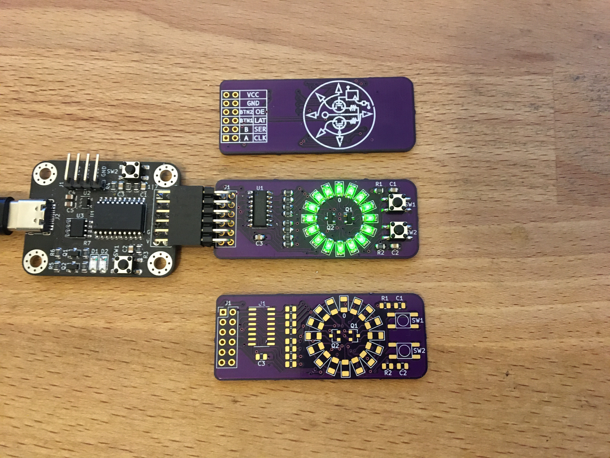
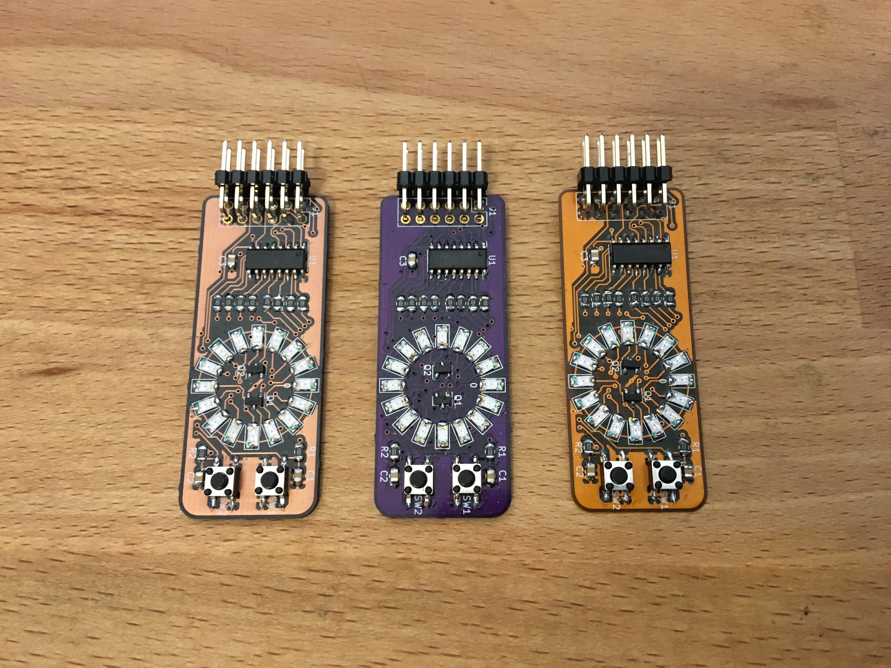
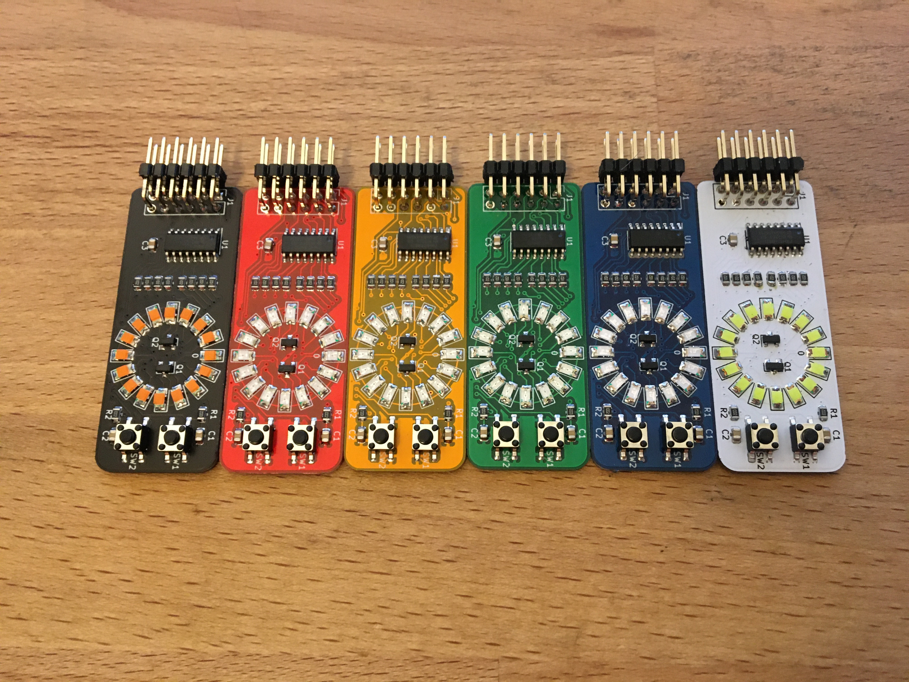
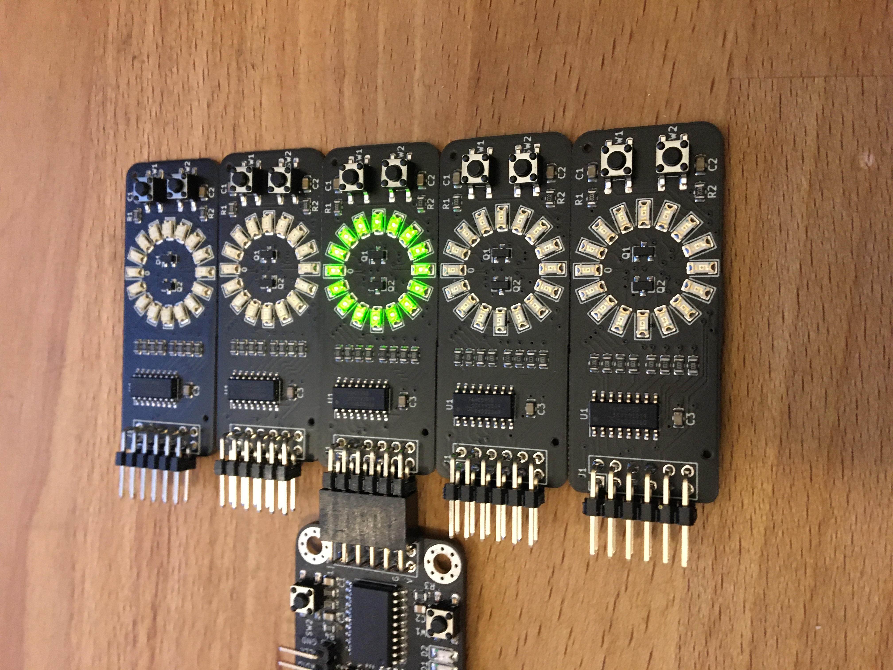

# Circle Display 

## Introduction
This repository contains all the design files, production files and example code for a simple circular LED display.

This readme assumes that you either know how to produce a board, source parts, and solder SMD components, or are willing to learn how to do these things. The production files have been tested using several production methods, so you shouldn't encounter issues making this board. The hints and instructions included should be enough to get you started.

## Parts

The following components are needed:

* 1x 74HC595 shift register in SOP16 package
* 3x 100nF capacitor in a 0805 package
* 8x 1k 0805 resistor
* 16x LED in a 1206 package
* 2x 2N7002 mosfet
* 2x 10k 0805 resistor (R1 and R2)
* 2x 4.5x4.5mm push button
* 1x 6x2 angled header

Notes:
1. The 1k resistors are for controlling the brightness of the LEDs and have been picked to get a reasonable amount of light, without being blinding. Use a lower value resistor for brighter LEDs. 
2. You can use any 1206 LED. If you don't know what color to use, you can get packages with small amounts of multiple colors from aliexpress/ebay.
3. The BOM can be found here: [circledisplay.csv](hardware/gerbers/circledisplay.csv) and contains article numbers for [LCSC.com](http://lcsc.com)

## Boards

Production files can be found in the [hardware/gerbers/](hardware/gerbers/) folder. Most vendors will accept the [zip file](hardware/gerbers/circledisplay.zip) with gerbers. Examples are Oshpark, JLCPCB, PCBWAY, and Dirtypcbs

Two vendors have been tested:

### Oshpark

L to R: After dark, Purple, Flex

[Oshpark](http://oshpark.com) is an American PCB manufacturer that specializes in small run prototype boards. They have decent prices for small orders and excellent customer service. They only do three types of boards: After dark, which is black substrate with clear solder mask. This shows the copper layers while also protecting them with a clear coat. Purple, which is their standard color. And flex, which are flexible pcbs. This design is not made for flex and it is not recommended to pick this option. All boards are made with gold plated solder pads and the default shipping option is free. You get three boards.

If you have never ordered pcb's you can't go wrong with Oshpark

### JLCPCB

All the possible soldermask colors of JLC

[JLCPCB](http://jlcpcb.com) is a Chinese PCB manufacturer. They have a prototype service, but can also do large quantities of boards. They offer much more options, like soldermask colors and plating material. With the default options they are similar in price as Oshpark for 5 boards, but if you order larger quantities the price per board drops significantly. Another advantage is that you can order solderpaste stencils with your pcbs.

Note that JLCPCB adds an order number to your PCBs. Click "specify location" at the remove ordernumber option to put that number under the chip. The required JLCJLCJLCJLC silkscreen is already under the chip.

SMT assembled boards

JLCPCB also offers a SMT assembly service, where you can get fully assembled boards. In addition to the zip file, you also need the [BOM](hardware/gerbers/circledisplay.csv) and the [placement file](hardware/gerbers/circledisplay-top-pos.csv). Note that these files have been manually corrected for parts rotation, so take extra care when re-exporting them from the kicad files. The headers aren't included in the files, as they add quite a bit of assembly costs.

If you just want the finished product this is the way to go. If you want to make your own boards in the future, I would recommend to start with getting the parts and boards and soldering them yourself. Getting boards ready for SMT adds another layer of complexity and isn't recommended for a beginner.

## Soldering

This readme doesn't have a soldering guide (yet). This board is similar enough to an older board that this guide: [https://github.com/pimdegroot/74595displaykit](https://github.com/pimdegroot/74595displaykit) translates to this board as well.

## Software

Software examples can be found in the [software/](software/) folder. Both Arduino and Circuitpython examples are offered. Note that you have to change the pinout to your dev board.

The circle is divided in groups of 8 LEDs. Mosfet A controls the right group and mosfet B the left one. The pins have the following functions:
* SER is the serial data in pin. Data should be shifted in most significant bit first.
* CLK shifts in the bit at the SER pin when going high
* LAT latches the data, shifting it from a temporary register to the output
* OE is output enable, and makes the chip output when low.
* MA and MB are the mosfets
* BTN1 is the top button, BTN2 is the lower button

The procedure for driving the 74HC595 is as follows:

### Setup
Drive SER, CLK, LAT, OE, MA and MB low. Set BTN1 and BTN2 as input.

### Update loop

Right side:
* Shift in the bits for the right side of the display, MSB first
* Set MB low
* Set LAT high
* Set MA high
* Set LAT low

Left side:
* Shift in the bits for the left side of the display, MSB first
* Set MA low
* Set LAT high
* Set MB high
* Set LAT low

## Final notes

The information in this repository is provided as is, and while care has been taken to eliminate all errors, there might still be bugs. As I have limited time to give support, please try to solve the problem yourself first. If you found an error in the repo, I would like to hear it in the form of an issue so I can fix it for everyone.

Have fun building the board, and I would love to see the results. You can contact me at [https://twitter.com/mifune](https://twitter.com/mifune)